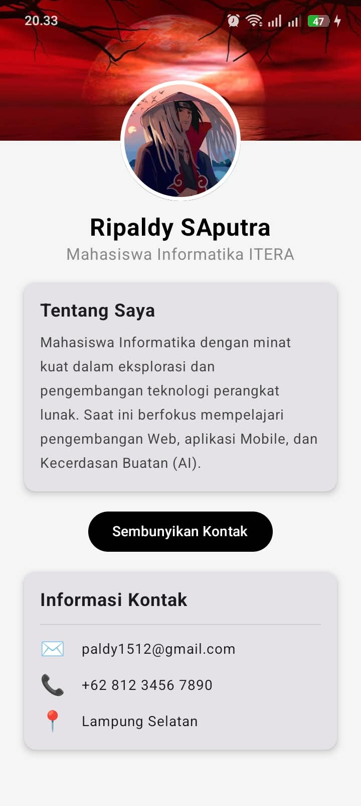

# Tugas Praktikum PAM - Minggu 3: My Profile App

**Nama:** Ripaldy SAputra  
**NIM:** 12340179  
**Mata Kuliah:** Pengembangan Aplikasi Mobile (PAM)

## Deskripsi Aplikasi
Aplikasi ini adalah "My Profile App" yang dibangun menggunakan **Compose Multiplatform**. Aplikasi ini menampilkan antarmuka profil pengguna interaktif yang terdiri dari gambar *cover* (latar belakang), foto profil melingkar, biodata singkat, dan panel informasi kontak.

## Tampilan Aplikasi
Berikut adalah *screenshot* hasil aplikasi saat dijalankan:

---

## Komponen & Konsep yang Diimplementasikan
Dalam pengerjaan tugas ini, saya telah menerapkan konsep-konsep UI Declarative dari modul Minggu 3, di antaranya:

### 1. Struktur Layout (Tata Letak)
- **`Column`**: Digunakan sebagai pondasi utama untuk menyusun elemen secara vertikal dari atas ke bawah.
- **`Row`**: Digunakan pada bagian "Informasi Kontak" untuk menyusun ikon dan teks secara horizontal.
- **`Box` (Stack Layout)**: Digunakan secara khusus untuk menciptakan efek *tumpang tindih* (overlap). Layer pertama berisi gambar *cover*, dan layer kedua berisi foto profil yang diberi jarak (*padding top*) sehingga letaknya menabrak garis bawah *cover* layaknya profil di media sosial profesional.

### 2. Komponen UI (Material 3)
- **`Text`**: Untuk menampilkan nama, profesi, dan deskripsi dengan pengaturan tipografi (`fontWeight`, `fontSize`, `color`).
- **`Image`**: Untuk menampilkan gambar lokal (file `.jpg` dan `.webp`) dengan pemotongan otomatis (`ContentScale.Crop`).
- **`Card`**: Menggunakan komponen kartu dengan efek bayangan (`elevation`) untuk menampung bagian "Tentang Saya" dan "Informasi Kontak".
- **`Button`**: Tombol interaktif yang telah diubah warnanya (*Black background, White text*) dan ukurannya dibuat menyesuaikan panjang kalimat (*wrap content*) dengan menghapus *modifier* `fillMaxWidth`.
- **`HorizontalDivider`**: Garis pembatas tipis untuk merapikan antarmuka kontak.

### 3. Penggunaan Modifier
- `.padding()` untuk mengatur jarak dalam dan luar antar komponen.
- `.clip(CircleShape)` dipadukan dengan `.border()` untuk membuat foto profil berbentuk lingkaran sempurna dengan garis tepi berwarna putih.
- `.background()` untuk memberi warna abu-abu terang pada layar utama aplikasi.

## ⭐ Fitur Bonus (+10%)
- **Animasi (AnimatedVisibility):** Aplikasi ini menerapkan *state* boolean (`showContactInfo`) yang terhubung dengan komponen `AnimatedVisibility`. Saat tombol "Tampilkan Kontak" ditekan, bagian *Card* informasi kontak akan muncul dan menghilang dengan transisi animasi yang halus (tidak muncul secara mendadak/kaku).
